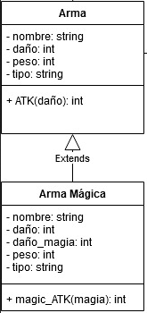

Final Reality
=============

This work is licensed under a
[Creative Commons Attribution 4.0 International License](http://creativecommons.org/licenses/by/4.0/)

Context
-------

This project's goal is to create a (simplified) clone of _Final Fantasy_'s combat, a game developed
by [_Square Enix_](https://www.square-enix.com)
Broadly speaking for the combat the player has a group of characters to control and a group of
enemies controlled by the computer.

---

Weapon.kt
---

En un inicio, sólo existe la clase Weapon, pero STAFF es de tipo mágico y tiene daño mágico.

Después de releer el enunciado, se consideró que todas las armas tienen el mismo comportamiento (posible abstracción).
En mi diagrama inicial, bajo esta lógica hice que MagicWeapon herede de Weapon pero ahora esto
no me parece del todo correcto. Aquí se aplicaría el Liskov Substitution Principle.

  

Ahora, en mi factorización me decanté más por una interfaz en lugar de utilizar una clase abstracta,
a pesar de lo que decia en el enunciado.

Weapontype
---

En esta parte del código base, si 
se desea implementar otro weaponType (por ejemplo) se incurriría a modificar las clases actuales, 
y se estaría violando el Open Closed Principle. Con esto me refiero a que lo mejor sería evitar enum
en estos casos pues, perfectamente (en un futuro) se pueden agregar métodos a un objeto Weapon que
dependan del weaponType.

